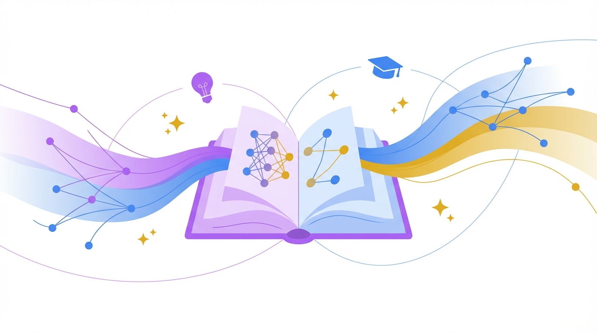

# ReLearn — AI-Powered Educational Platform

> The first AI study platform that doesn't just chat — it **ACTS**. It generates podcasts from your notes, creates study plans from your quiz scores, and adapts to how you learn.



## ✨ Features

### 🎙️ AI Podcast Generation
Upload any document → get a two-host podcast discussing your material. Alex (the explainer) and Sam (the curious learner) break down concepts in a natural, engaging conversation. Uses Web Speech Synthesis for TTS with different voices per host.

### 🗣️ Voice Tutor Mode
Talk to your AI tutor like a real conversation. Press the mic button, ask your question, hear the AI explain back. Continuous conversation mode keeps the dialogue flowing — like having a private tutor.

### 🤖 AI Study Planner
An AI agent that analyzes your performance, identifies weak topics, and generates a personalized weekly study plan. Includes focus areas, daily goals, and estimated time to mastery.

### 📊 Learning Analytics Dashboard
Track your progress with beautiful SVG charts:
- Quiz scores over time (bar chart)
- Topic strength radar chart
- GitHub-style activity heatmap
- Study streak & stats cards with animated counters

### 🖼️ AI Mind Map / Infographic
Turn your notes into interactive visual mind maps. Central topic with radiating branches — CSS-animated nodes and SVG connection paths. Click any node to expand details.

### 📝 AI Study Reports
Generate comprehensive study guides from your materials. Includes key concepts, important formulas, study tips, practice questions, and summaries with source citations.

### 🔄 Spaced Repetition System (SM-2)
Flashcards that adapt to your memory. Uses the SM-2 algorithm:
- Cards you get wrong come back sooner
- Cards you know well space out over days/weeks
- 4 response levels: Again / Hard / Good / Easy
- LocalStorage persistence for review scheduling
- Celebration animation when all caught up!

### 🌐 Multi-Language AI Tutoring
All AI-generated content (flashcards, quizzes, summaries, podcasts) can be generated in 10+ languages. Language selector in header.

### 🧠 Snap a Problem
Take a photo or upload an image of any problem → AI analyzes it and provides:
- Problem detection & text extraction
- Step-by-step solution with explanations
- Similar practice problems

### 👥 Collaborative Spaces
Share spaces with classmates:
- Invite by email or share link
- Role-based access (Owner/Editor/Viewer)
- Activity feed showing collaborator actions
- Comment threads on documents

### Plus: Everything from the Core Platform
- 📚 **Spaces System** — Organize courses with multi-document support
- 💬 **AI Chat** — RAG-powered Q&A grounded in your documents
- 🃏 **Flashcards** — AI-generated with flip animations
- ❓ **Quizzes** — Multiple-choice with explanations
- 📖 **Summaries, Notes, Chapters** — AI-generated study materials
- 📄 **Real PDF Rendering** — Full page rendering with react-pdf
- 🎥 **YouTube Integration** — Embedded player + transcript extraction
- 🎤 **Record** — Record lectures with waveform visualization
- 🔍 **Search** — Semantic search across all spaces and docs
- 🌙 **Dark Mode** — Full light/dark/system theme support
- 🎨 **AI-Generated Illustrations** — 19 custom images via Nano Banana Pro

## 🛠️ Tech Stack

- **Framework**: Next.js 14 (App Router)
- **Language**: TypeScript 5.7
- **Styling**: Tailwind CSS 3.4 + Radix UI
- **AI**: GitHub Copilot API (GPT-4o + model selection)
- **PDF**: react-pdf + pdf-parse
- **Images**: AI-generated via Gemini 3 Pro Image (Nano Banana Pro)
- **TTS**: Web Speech Synthesis API
- **STT**: Web Speech Recognition API
- **SRS**: SM-2 algorithm with localStorage persistence

## 🚀 Getting Started

```bash
git clone https://github.com/KNIGHTABDO/relearn.git
cd relearn
npm install
npm run dev
```

Open [http://localhost:3000](http://localhost:3000)

### AI Setup (Optional)
To enable AI features, connect your GitHub Copilot in Settings:
1. Go to Settings → Connect GitHub
2. Follow the device code authentication
3. Select your preferred AI model

Without Copilot, the app uses demo data so you can still explore all features.

## 📁 Project Structure

```
src/
├── app/
│   ├── page.tsx                    # Home dashboard
│   ├── progress/page.tsx           # Analytics dashboard
│   ├── space/[id]/page.tsx         # Space detail
│   ├── learn/page.tsx              # Document learning view
│   ├── api/
│   │   ├── chat/route.ts           # AI chat (RAG)
│   │   ├── generate/route.ts       # Flashcards, quiz, summary, notes
│   │   ├── podcast/route.ts        # AI podcast generation
│   │   ├── study-plan/route.ts     # AI study planner
│   │   ├── snap/route.ts           # Image problem solving
│   │   ├── translate/route.ts      # Multi-language translation
│   │   └── ...
├── components/
│   ├── learn/
│   │   ├── learning-panel.tsx      # Main tool panel (12 features)
│   │   ├── podcast-player.tsx      # Podcast player + TTS
│   │   ├── voice-tutor.tsx         # Voice conversation mode
│   │   ├── study-planner.tsx       # AI study plan generator
│   │   ├── analytics-dashboard.tsx # Progress charts & stats
│   │   ├── infographic-viewer.tsx  # Mind map generator
│   │   ├── study-report.tsx        # Comprehensive study guide
│   │   ├── spaced-repetition.tsx   # SM-2 flashcard system
│   │   ├── snap-problem.tsx        # Camera/image problem solver
│   │   ├── collab-panel.tsx        # Collaboration features
│   │   ├── flashcard-viewer.tsx    # Standard flashcard viewer
│   │   ├── quiz-viewer.tsx         # Quiz with scoring
│   │   └── chat-panel.tsx          # AI chat interface
│   └── ...
├── lib/
│   ├── store.ts                    # In-memory data store
│   ├── types.ts                    # TypeScript interfaces
│   ├── github-auth.ts              # Copilot auth manager
│   └── utils.ts                    # Utilities
└── public/
    └── images/                     # 19 AI-generated illustrations
```

## 📄 License

MIT

---

Built with ❤️ and a lot of AI
